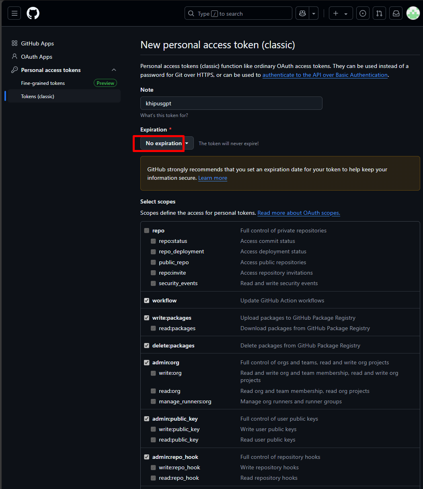

# Creating a Personal Access Token (Classic) for GitHub Models

This guide provides a step-by-step process for generating a **Personal Access Token (Classic)** to use GitHub models, including **Azure OpenAI GPT-4o** in the [GitHub Models Marketplace](https://github.com/marketplace/models/azure-openai/gpt-4o/playground).

## Steps to Generate a Personal Access Token (Classic)

### 1. Open the GitHub Models Playground
- Navigate to [GitHub Models](https://github.com/marketplace/models/azure-openai/gpt-4o/playground).
- Click **"Use this model"** in the top-right corner.

### 2. Get Developer Key
- A window will appear prompting you to create an API key.
- Click on **"Get developer key"** under the **GitHub** section.

### 3. Go to Developer Settings
- You will be redirected to the **GitHub Developer Settings** page.
- Click on **"Personal access tokens"** in the left menu.
- Under **Tokens (classic)**, click **"Generate new token (classic)"**.

### 4. Configure the Token
- **Note**: Enter a name for the token (e.g., `github-models-token`).
- **Expiration**: Select **"No expiration"** (not recommended for security reasons, but optional).
- **Scopes**: Select the required scopes for API access. Recommended scopes:
  - `repo` (Full control of private repositories)
  - `workflow` (GitHub Actions workflows access)
  - `write:packages` and `read:packages` (Access to GitHub Package Registry)
  - `codespace` (Manage GitHub Codespaces)
  - `copilot` (Manage Copilot settings)
  - `admin:public_key`, `admin:gpg_key`, `admin:repo_hook` (For repository and SSH key management)
  
### 5. Generate and Copy the Token
- Click **"Generate token"** at the bottom.

- Copy the generated token **immediately** and store it securely.
- You **won’t be able to see the token again** once you leave the page.

### 6. Use the Token in Your Code

---
### Notes:
- It’s **highly recommended** to set an expiration date for security purposes.
- Do **not** share your token publicly.
- If the token is compromised, revoke it immediately in **GitHub Developer Settings**.

For more details, refer to [GitHub’s documentation on Personal Access Tokens](https://docs.github.com/en/github/authenticating-to-github/creating-a-personal-access-token).
