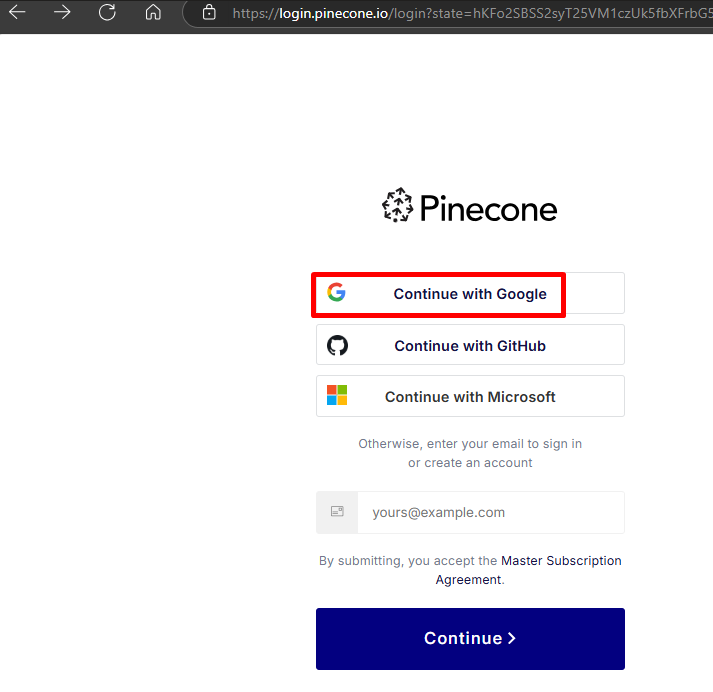
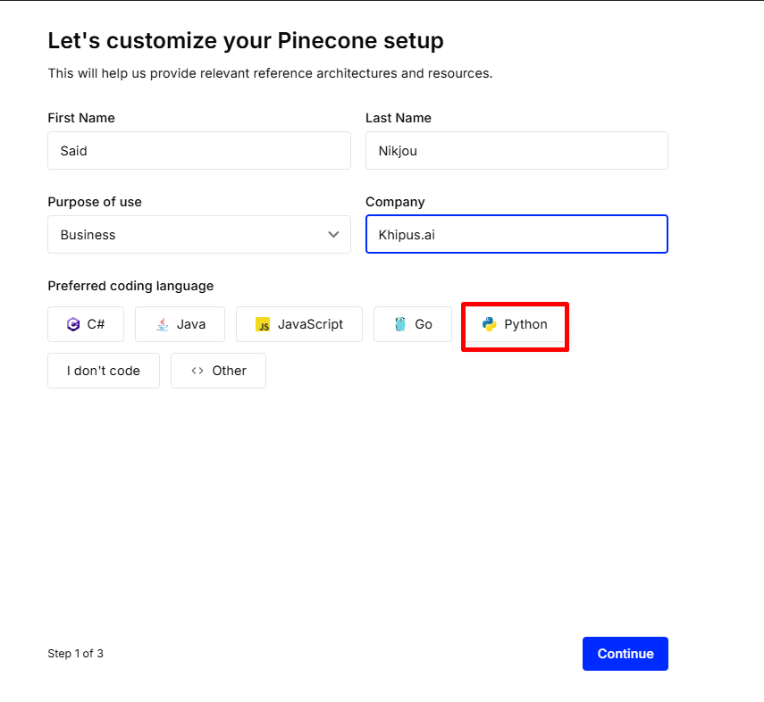
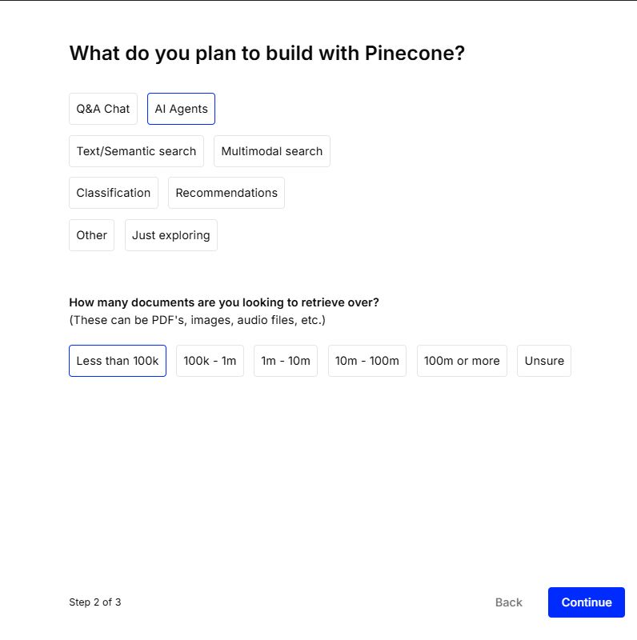
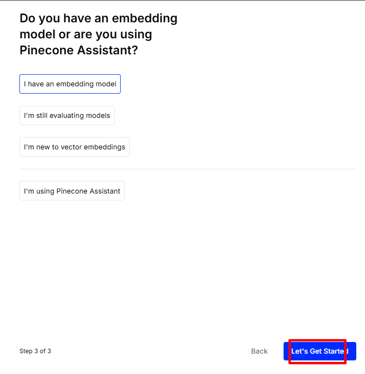
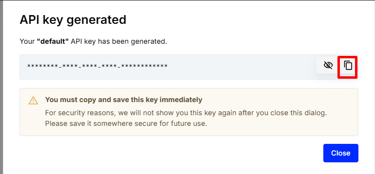

# **Khipus.ai**
# Creating a Pinecone Account - Assignment 3 - Part 1
# © Copyright Notice 2025, Khipus.ai - All Rights Reserved.

This guide walks you through setting up a **free Pinecone vector database account**, completing the onboarding questionnaire, and generating your first API key.

---

## Prerequisites

- A valid **Google, GitHub, or Microsoft** account _(or an email address you can verify)._
- A modern web browser (Chrome, Edge, Firefox, Safari).

---

## 1  Navigate to the Pinecone sign‑in page

1. Open a browser and go to <https://www.pinecone.io/> and select **Sing up**.
2. Click **Continue with Google** (highlighted in the screenshot below).  
   _You may instead choose GitHub, Microsoft, or sign up with email._

---

## 2  Complete the account details form

After authentication you will be asked to **customize your Pinecone setup**:

| Field | Example value |
|-------|---------------|
| **First Name** | Your Name |
| **Last Name** |  Your Last neme|
| **Purpose of use** | Business |
| **Company** | Khipus.ai |
| **Preferred coding language** | Python |

1. Fill in each field.  
2. Select your preferred language (Python is shown selected).  
3. Click **Continue**.

---

## 3  Tell Pinecone what you plan to build

1. Choose the primary use‑case. In the example we select **AI Agents**.  
2. Estimate the size of your corpus (e.g. **Less than 100 k** documents).  
3. Click **Continue**.

---

## 4  Specify your embedding model status

Select the option that best fits your workflow. Most developers who already work with OpenAI or another embedding provider should choose **I have an embedding model**.  
After selecting, click **Let’s Get Started**.

---

## 5  Generate and save your API key

Pinecone immediately issues a **default** API key:

> **Important:** The key is shown **only once**. Click the clipboard icon to copy it, then store it in a secure location such as an environment variable manager (e.g., GitHub Secrets, Azure Key Vault, or a local `.env` file).
