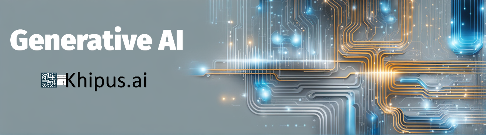

The Generative Artificial Intelligence module focuses on the foundational architecture driving the latest advancements in Generative AI. Through an exploration of deep neural networks, the course delves into large language models (LLMs), which leverage millions or even billions of parameters trained on vast datasets. Key components such as Transformers, embeddings, and attention mechanisms are examined—technologies that have revolutionized natural language processing tasks like text generation, semantic classification, and contextual understanding.

Additionally, the module introduces Retrieval-Augmented Generation (RAG), as well as evaluation and security practices for deploying LLMs. The focus expands from technical aspects to practical applications involving information interpretation, mitigation of issues such as hallucination, and the development of effective prompts. This learning will equip participants to build, adapt, and validate LLM-based applications.